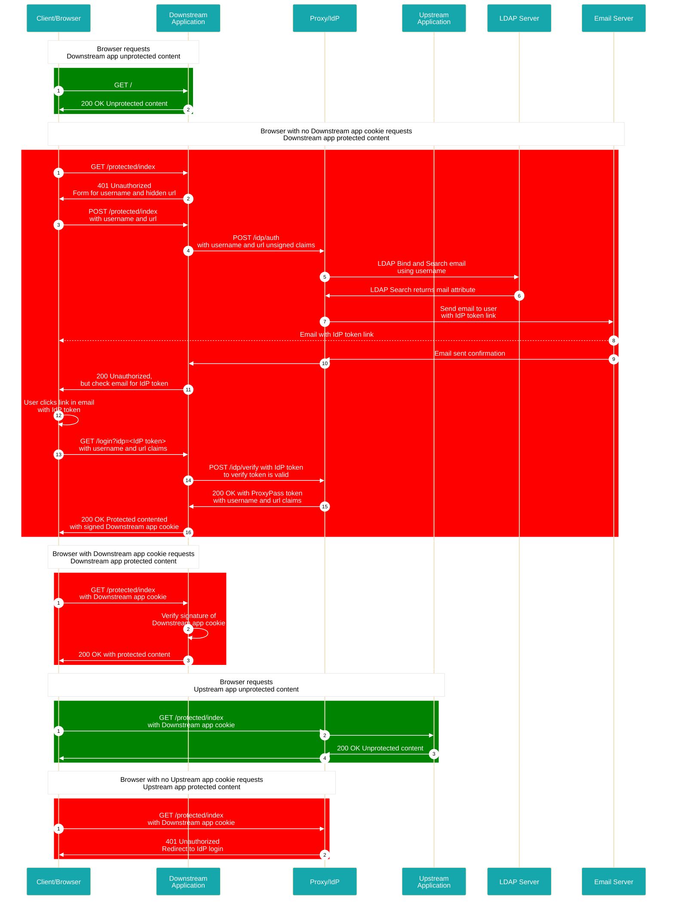

```mermaid
%%{
  init: {
    'theme':'base',
    'themeVariables': {
      'actorBkg': '#16a7acff',
      'noteBkgColor': '#fff',
      'noteTextColor': '#000',
      'primaryTextColor': '#fff',
      'sequenceNumberColor': '#000'
    }
  }
}%%
sequenceDiagram
  participant B as Client/Browser
  participant D as Downstream<br>Application
  participant P as Proxy/IdP
  participant U as Upstream<br>Application
  participant L as LDAP Server
  participant E as Email Server

  autonumber off
  B-->E: 
  autonumber 1

  note over B,D: Browser requests <br> Downstream app unprotected content
  rect rgba(0, 131, 0, 1)
  B->>D: GET /
  D->>B: 200 OK Unprotected content
  end

  autonumber off
  B-->E: 
  autonumber 1

  note over B,E: Browser with no Downstream app cookie requests <br> Downstream app protected content
  rect rgba(255, 0, 0, 1)
  B->>D: GET /protected/index
  D->>B: 401 Unauthorized <br> Form for username and hidden url
  B->>D: POST /protected/index <br> with username and url
  D->>P: POST /idp/auth <br> with username and url unsigned claims
  P->>L: LDAP Bind and Search email <br> using username
  L->>P: LDAP Search returns mail attribute
  P->>E: Send email to user <br> with IdP token link
  E-->>B: Email with IdP token link
  E->>P: Email sent confirmation
  P->>D: 
  D->>B: 200 Unauthorized, <br> but check email for IdP token
  B->>B: User clicks link in email <br> with IdP token
  B->>D: GET /login?idp=<IdP token> <br> with username and url claims
  D->>P: POST /idp/verify with IdP token <br> to verify token is valid
  P->>D: 200 OK with ProxyPass token <br> with username and url claims
  D->>B: 200 OK Protected contented <br> with signed Downstream app cookie
  end

  autonumber off
  B-->E: 
  autonumber 1

  note over B,D: Browser with Downstream app cookie requests <br> Downstream app protected content
  rect rgba(255, 0, 0, 1)
  B->>D: GET /protected/index <br> with Downstream app cookie
  D->>D: Verify signature of <br> Downstream app cookie
  D->>B: 200 OK with protected content
  end

  autonumber off
  B-->E: 
  autonumber 1

  note over B,U: Browser requests <br> Upstream app unprotected content
  rect rgba(0, 131, 0, 1)
  B->>P: GET /protected/index <br> with Downstream app cookie
  P->>U: 
  U->>P: 200 OK Unprotected content
  P->>B: 
  end

  autonumber off
  B-->E: 
  autonumber 1

  note over B,P: Browser with no Upstream app cookie requests <br> Upstream app protected content
  rect rgba(255, 0, 0, 1)
  B->>P: GET /protected/index <br> with Downstream app cookie
  P->>B: 401 Unauthorized <br> Redirect to IdP login
  end
```
